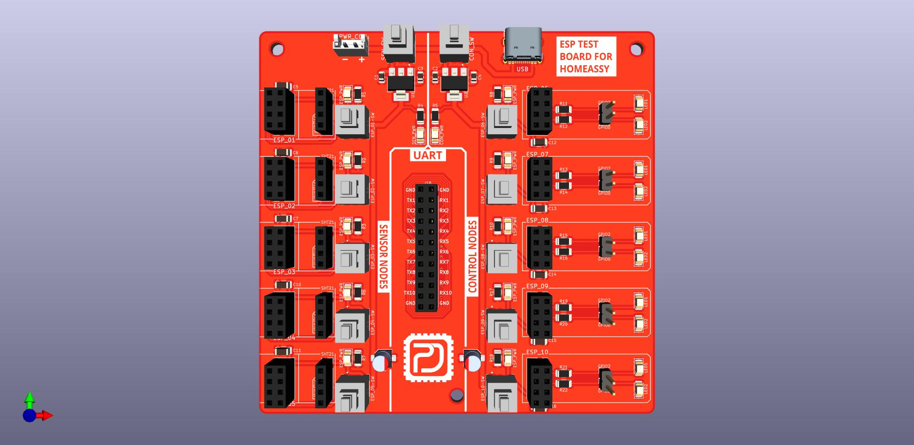
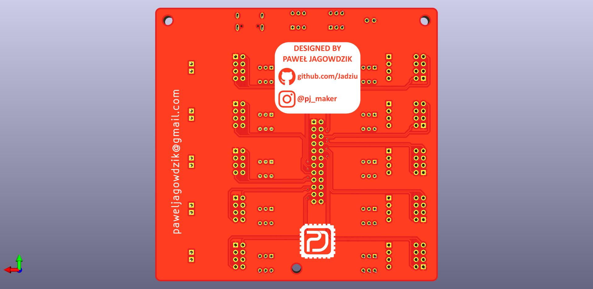

# Test Board for ESP-01

***

Płyta testowa dzięki, której można uruchomić 10 modułów ESP-01 z jednego źródła zasilania.
PCB zostało podzielone na trzy sekcje: 
- SENSOR NODES (5 modułów)
- CONTROL NODES (5 modułów)
- UART

Sekcja UART jest zbiorem wyprowadzeń transmisji szeregowych z wszystkich 10 modułów.

Sekcje SENSOR oraz CONTROL mają osobne zasilanie realizowane przez stabilizatory
napięcia AMS1117-3.3V. Każda z tych sekcji ma osobny włącznik.

W sekcji SENSOR do modułów ESP można podłączyć czujniki lub inne urządzenia z magistralą 
I2C i zasilaniem 3.3V.

W skecji CONTROL zostały wyprowadzone dwa piny GPIO i podłączone diody sygnalizacyjne.

Dla każdego modułu ESP przewidziany jest włącznik.

***

***